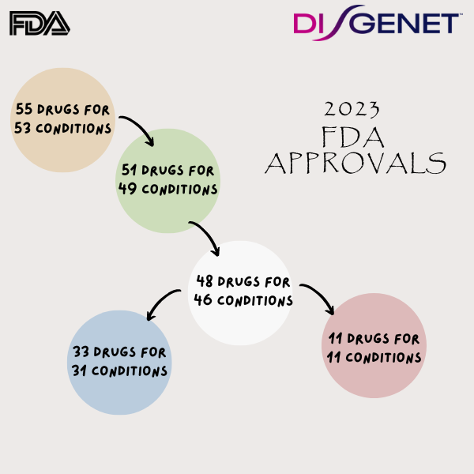

# Genetic support for FDA approvals in 2023

 

   

This repository contains an [analysis of the genetic support for the drugs approved by the FDA in 2023 using DISGENET data](https://jpinero.github.io/genetic-support-fda-approvals-2023/genetic_support_drugs_2023.html ). 

   
See a blog post with more information [here](https://www.medbioinformatics.com/2024/08/28/genetics-drug-discovery-clinical-trial-success/).S

